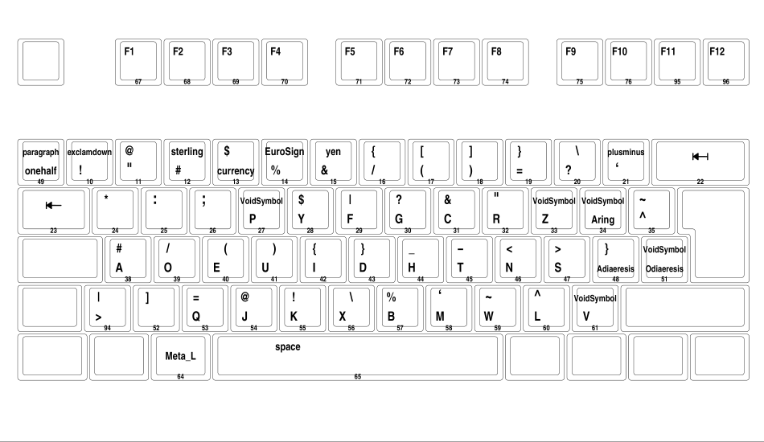
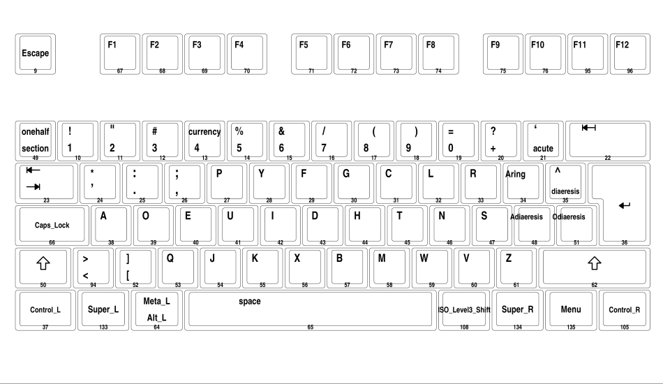

# Swedish dvorak: english programmer
Dvorak layout for swedish programmers who mainly communicate in english, inspired by [svorak_a5](http://aoeu.info/s/dvorak/svorak)

This layout will change a lot as I figure out what works and what doesn't.
## Installation
It is easiest to overwrite the old layout file, but make a backup first! The layout file in this repo contains all other layouts already, so you won't lose anything.
``` bash
git clone git@github.com:samhedin/se_dvorak_ep.git
cd se_dvorak_ep
sudo mv /usr/share/X11/xkb/symbols/se /usr/share/X11/xkb/symbols/se.bak
sudo cp dvorakep /usr/share/X11/xkb/symbols/se
setxkbmap se dvorak_ep
```

## Notable differences with Svorak a5/Dvorak
- `åäö` are downprioritized in favor of `'.,` since I mostly write code or in English.
- Adjusted for Vim. Vim bindings work surprisingly well with dvorak, with some minor exceptions. For example, in dvorak L is bound to `right pinky top right` by default, which is just painful. This layout aims to fix those minor annoyances.
- Other than that, most changes are to the keys accessed with `altgr` based on how much I use them.
## Images
### When altgr is held down


### Normal/Shift


### TODO
Make images not look like shit, preferably show all levels in one image.