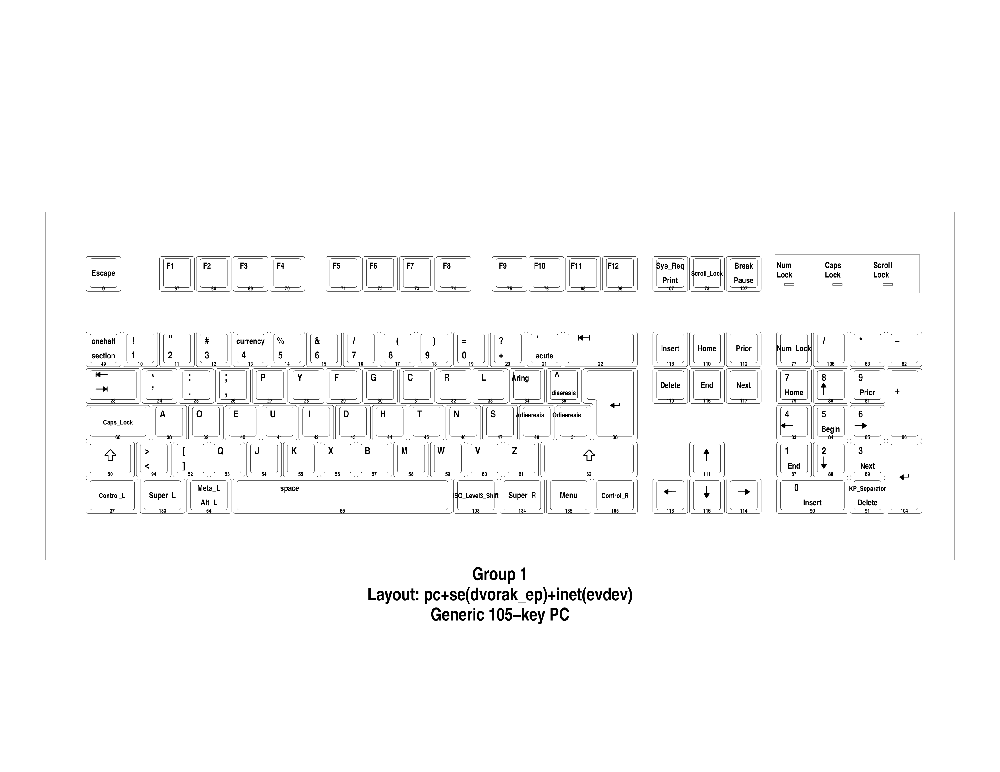
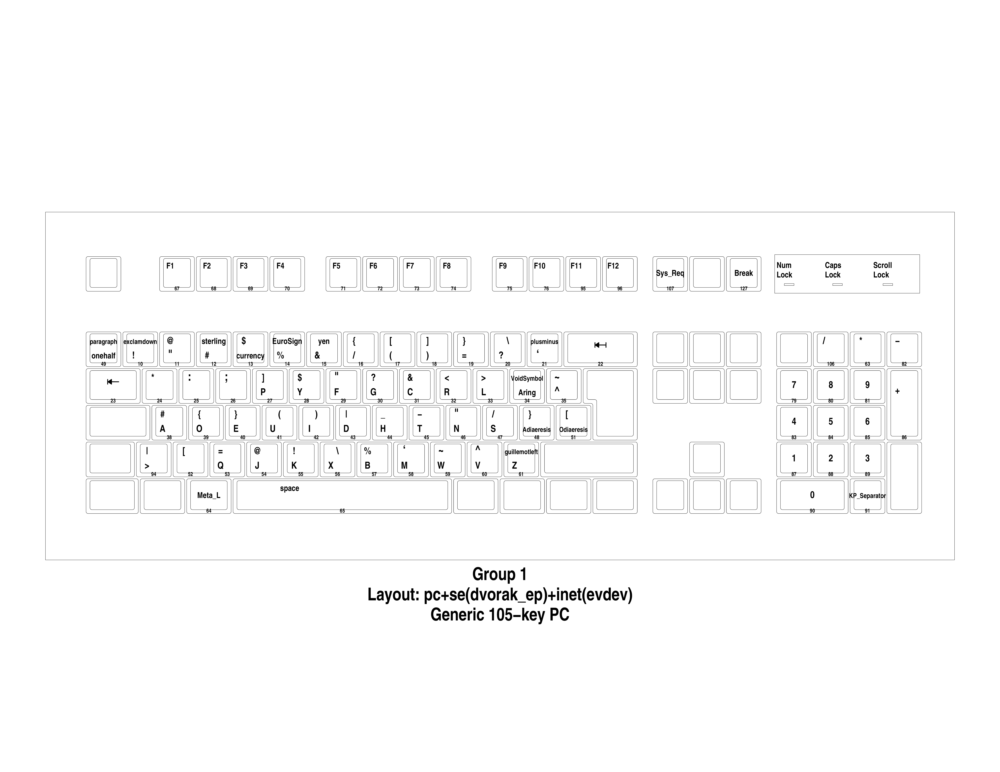

# Swedish dvorak: english programmer
Swedish dvorak layout for programmers who mainly communicate in English, inspired by svorak a5 http://aoeu.info/s/dvorak/svorak

This layout will change quite a lot in the coming weeks.
## Installation
It is easiest to overwrite the old layout file, but make a backup first!
``` bash
git clone git@github.com:samhedin/se_dvorak_ep.git
cd se_dvorak_ep
sudo mv /usr/share/X11/xkb/symbols/se /usr/share/X11/xkb/symbols/se.bak
sudo cp dvorakep /usr/share/X11/xkb/symbols/se
setxkbmap se dvorak_ep
```

## Differences with Svorak a5
`åäö` are downprioritized in favor of `'.,`. I mostly program or write in english, no reason for `åäö` to be in very good locations.
Other than that, most changes are to the keys accessed with `altgr`.
`-` and `_` are on `altgr + t` and `altgr + h` respectively. I use them often and therefore they should have high priority.

## Images
`xkbprint -ll 1 :0.0 -o layout1.ps; gs -dSAFER -dEPSCrop -r600 -sDEVICE=pngalpha -o layout1.png layout1.ps; mogrify -flatten -rotate "-90" layout1.png; rm layout1.ps;`


`xkbprint -ll 2 :0.0 -o layout2.ps; gs -dSAFER -dEPSCrop -r600 -sDEVICE=pngalpha -o layout2.png layout2.ps; mogrify -flatten -rotate "-90" layout2.png; rm layout2.ps;`

### TODO
Make images not look like shit
